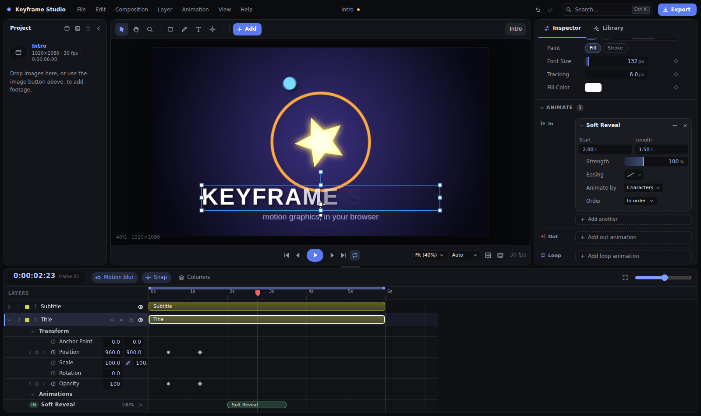

# Keyframe Studio

A browser-based motion graphics and compositing editor, built from scratch with TypeScript, React and the Canvas 2D API.
It follows the workflow of professional compositing tools — compositions, a layer timeline, keyframes, effects, precomps — without being a clone of any of them.

> **Not affiliated with, derived from, or a replacement for any commercial product.** It is an original codebase with its own name, UI and file format.
> It covers the core 2D workflow well; it is deliberately *not* feature-complete. See [Limitations](#limitations).



```bash
npm install
npm run dev        # http://localhost:5173
```

Open it and you land in a small demo composition. **Space** plays and **Export** (top right) renders it to video. Press **Ctrl K** to search every command, effect, layer and template. *Help → Keyboard Shortcuts* (or **?**) lists everything.

## A quick tour

The interface is built around three ideas: *everything you select is editable in one place*, *everything the library gives you stays adjustable*, and *anything can be found by typing*.

- **Inspector** (right panel). Select a layer and every property is there — transform, text or shape settings, applied animations, effects, letter animators, masks — as sliders, scrub fields and a colour picker. Bounded values are filled sliders (drag, click to type, arrow keys to nudge); changed values show a reset button; the diamond animates a property and ◂ ◆ ▸ step between its keyframes. Expand any animated property to get a **value graph** (drag keys in time and value) and a **keyframe list** with each key's time, value and easing curve, plus *Repeat* and *Wiggle*. With nothing selected it shows the composition (size presets, frame rate, duration, background).
- **Animate** (in the Inspector). Everything applied from the library as an animation is remembered as a unit, grouped as **In / Out / Loop / Emphasis**. Each has **Start**, **Length**, **Strength** (how far it strays from the layer's resting values), **Easing** (any curve, edited with draggable handles or picked from 53 presets) and, for text, *Animate by* characters / words / lines and *Order*. Picking another In or Out animation replaces the old one; a text entrance, loop and exit can all coexist. The same blocks appear on the **timeline** as clips you can drag to move or resize to retime.
- **Library** (right panel). 333 templates with live thumbnails (hover to play). Click to apply at the playhead, or **drag onto a layer** in the viewer or timeline — entrances land at the layer's start, exits end as it ends. Star favourites with the heart; a tick marks what's already on the selected layer.
- **My presets.** Tuned an animation the way you like it? Open its ⋯ menu → *Save as preset…* (or use the heart in *Effects* to save a whole effect stack as a look). It joins the Library under **My presets**, the Animate pickers, drag-and-drop and Ctrl K, and applies relative to whichever layer you give it. Presets live in your browser's storage.
- **Ctrl K palette.** Commands, effects, layers and the whole library in one search box (“neon”, “align”, “blur”, “slide”…).
- **Viewer.** Smart guides snap to the composition's edges and centre and to other layers (hold Alt to bypass); right-click for layer actions; an **Add** menu creates text, shapes, solids, images and compositions; align and distribute buttons work on one layer (to the canvas) or several (to each other); **Stagger** offsets entrances across selected layers.

## What it does

**Compositions & timeline**
- Multiple compositions (open as tabs), nestable as **precomps**; per-comp size, frame rate, duration, background, work area.
- AE-style timeline: layer switches (visibility, solo, lock, motion blur), blend mode / track matte / parent columns, twirl-down properties, `P S R T A U` property reveal, draggable layer bars (slide + trim), time ruler with work area, playhead, zoom.
- Snapping of layer edges and keyframes to the playhead and other layers (hold **Alt** to bypass), layer re-ordering by dragging the layer number, split / duplicate / copy / paste / sequence layers.

**Animation**
- Stopwatch keyframing on every property: transform, shape/text/solid contents, effect parameters, mask paths.
- Per-segment **bezier easing** with an interactive curve editor (overshoot supported), linear, hold, Easy Ease / In / Out, time-reverse.
- **Curved motion paths** for Position with constant-speed (arc-length) timing, drag points and handles in the viewer, one-click auto-bezier smoothing.
- **Wiggle** and **loop** (cycle / ping-pong) as built-in, deterministic property modifiers — no scripting involved.
- **Text animators** — AE-style range selectors over characters, words or lines that move, scale, rotate, fade, space and tint individual letters (with a per-letter ease: back, elastic, bounce).
- **Multi-stop gradients** (linear, radial, angular, reflected; repeat/mirror; animatable colours and phase) with a stop editor — fill any layer, text included.

**Editing**
- One **Inspector** for everything selected, with sliders, reset-to-default, per-keyframe time/value/easing, a value graph, loop and wiggle.
- **Library animations are live objects**: retime, rescale, re-ease, replace or remove them at any time, from the Inspector or as clips on the timeline.
- **My presets**: save any tuned animation or effect stack and reuse it.
- **Command palette** (Ctrl K), **drag-and-drop** from the library onto layers, **smart snapping guides**, align / distribute / stagger, a right-click menu, favourites, and a custom **colour picker** with the project's own colours.

**Layers**
- Solids, shape layers (rectangle, ellipse, polygon, star, **freeform bezier paths** with trim paths), text, images, nulls, adjustment layers, precomps.
- **Pen tool** with drag-out curve handles; vertex/tangent editing, add/remove vertices, smooth/corner toggle.
- **Masks** (add / subtract / intersect / none, invert, feather, opacity, expansion) with animatable paths.
- Parenting (cycle-safe), 17 blend modes, alpha / luma track mattes (and inverted), anchor-point (pan-behind) tool.

**Rendering**
- Per-layer transform, opacity, blend, effects stack, masks, mattes, adjustment layers, precomps — all composited in a single pass.
- Real **motion blur** (sub-frame accumulation in float space, shutter angle) and 22 effects (including a multi-stop **Gradient Fill**): Gaussian / Directional blur, Mosaic, Brightness & Contrast, Levels, Hue/Saturation, Black & White, Invert, Tint, Threshold, Posterize, Drop Shadow, Glow, Vignette, Fill, Gradient Ramp, Checkerboard, Noise, Fractal Noise, Linear / Radial Wipe.
- Each layer is processed only inside its own transformed bounds (plus effect padding), so small layers stay cheap and off-screen layers cost nothing.

**Output**
- **WebM (VP9)** and **MP4 (H.264)** via WebCodecs — rendered one frame at a time, so output is frame-accurate (30 frames in = 30 frames out), never real-time capture. The WebM path is covered by the e2e suite (checked with `ffprobe`); the MP4 path is implemented but **not verified here**, because the headless Chromium used for testing has no H.264 encoder.
- PNG sequence (`.zip`, no external libraries) and single PNG frames (optionally with alpha).

**Projects**
- Save / open as a plain-JSON `.kfs` file; autosave to browser storage; undo/redo (drags collapse to one step).
- Project files are treated as untrusted input: strictly validated, size-limited, and never evaluated.

## Template library

The **Library** tab holds **333 ready-made templates**, each shown as a live thumbnail rendered by the real renderer (hover to play the animation). Everything it applies is ordinary, editable keyframes, effects and animators — nothing is baked.

| Category | Count | What it does |
| --- | --- | --- |
| **Text Styles** | 44 | Neon (6), outlines, shadows & 3D extrude, glitch, gradients (sunset, fire, ice, rainbow…), metals (gold foil, chrome, rose gold), retro / comic / terminal / horror… Replaces the previous style, keeps your own effects. |
| **Text Animations** | 44 | Typewriter, soft/word/line/scatter reveals; per-letter entrances (slide, drop & bounce, pop, elastic, spin, flip, tumble, zoom, spread); exits; looping waves, highlight sweeps, breathing, colour pulse. |
| **Gradients** | 54 | Warm, cool, vivid, spectrum, pastel, metal, nature, basic. Fill the selection, or **BG** adds a full-frame gradient background. |
| **Easing** | 53 | Sine → expo/circ, back/overshoot, bounce, elastic, spring, steps, Material/UI curves — as a gallery (also inside the keyframe curve editor). |
| **Motion** | 63 | Slide/zoom/pop/bounce/elastic/drop/spin/flip/blur/glitch/wipe in & out, loops (pulse, heartbeat, float, sway, shake…), curved paths (orbit, figure-eight, arc, S-curve), one-shot emphasis (rubber band, tada, jello, hop…). |
| **Looks** | 40 | Glows & bloom, shadows, grades (noir, sepia, duotones, tints, faded film), VHS / RGB split / pixelate, animated focus-in, flash, hue cycle. |
| **Scenes** | 35 | Gradient & animated backgrounds (flowing aurora, clouds, bokeh), title cards, lower thirds, loader ring, progress bar, confetti burst, ripples, twinkling stars. |

Templates are plain data in `src/templates/`; a unit test applies every one, checks it survives a save/load round trip, and checks that re-applying never stacks duplicates, and a browser test renders every thumbnail at several times.

Animations (motion, text animations and the animated looks) are tracked as **instances**: everything one creates — keyframes, effects, letter animators — is tagged with the instance, so Start, Length, Strength and Easing edit it as a whole, and removing it leaves nothing behind. *Strength* scales each animated value around the property's resting value (a slide travels half as far at 50%, a spin turns half as much); text range selectors are left alone because they are positions along the text, not amounts.

## Keyboard shortcuts (essentials)

| Key | Action | Key | Action |
| --- | --- | --- | --- |
| `Space` | Play / pause | `J` / `K` | Previous / next keyframe |
| `P S R T A` | Reveal Position / Scale / Rotation / Opacity / Anchor | `U` | Reveal animated properties |
| `[` `]` | Slide layer in/out to playhead (`Alt` = trim) | `B` / `N` | Work area start / end |
| `V H Z Q G Y` | Select, Hand, Zoom, Shape, Pen, Anchor tools | `F9` | Easy ease (`Shift`: in, `Ctrl+Shift`: out) |
| `Ctrl+C/X/V` | Copy / cut / paste layers or keyframes | `Ctrl+D` | Duplicate |
| `Ctrl+Shift+D` | Split layer at playhead | `Ctrl+Shift+C` | Pre-compose |
| `Ctrl+Z` / `Ctrl+Shift+Z` | Undo / redo | `Ctrl+S` / `Ctrl+O` / `Ctrl+M` | Save / open / export |
| `Ctrl+K` | Command palette | `Ctrl+Shift+K` | Composition settings |
| `?` | Keyboard shortcuts | `Alt` (while dragging) | Bypass snapping |

## Architecture

```
src/
  templates/ The library: easing, gradients, text styles/animations, motion, looks, scenes — plain data plus small authoring helpers.
  core/      Pure data & maths — no DOM. The document model (types.ts), keyframe interpolation incl. bezier
             easing, wiggle, loops and arc-length motion paths (interp.ts), bezier path geometry (path.ts),
             effect definitions, factories, project (de)serialisation and validation. anims.ts edits applied
             library animations as units (retime, strength, easing, remove); defaults.ts, color.ts.
  render/    Canvas 2D renderer: layer painters, effects, masks, mattes, motion blur, a canvas pool,
             hit-testing/geometry, and export (WebCodecs muxing, zip writer).
  state/     A small external store, an undo/redo history with gestures, and every user action.
  ui/        React panels: viewer (gizmos, pen, snapping), timeline, Inspector (property rows, animation cards,
             pickers, colour and easing editors), library, command palette, dialogs, shortcuts.
e2e/         Browser end-to-end suites (Playwright + headless Chromium) that assert on rendered pixels.
```

Design notes:

- **Everything animatable is a `Prop`** (`number | vec2 | color | path`) with optional keyframes, wiggle and loop. Transform values, shape contents, effect parameters and mask paths all share one evaluator, one timeline row type and one set of keyframe commands.
- **The document is plain JSON** and is cloned for each edit, which gives undo/redo, autosave and file saving with no extra machinery. Footage bytes live outside the document so clones stay cheap.
- **Bezier paths are flat number arrays** (six numbers per vertex), so they interpolate between keyframes element-wise like any other property.
- **Rendering is a pure function** of `(project, comp, time, options)`: the viewer, exporter and tests all call the same `renderComp`.

## Development

```bash
npm run dev         # dev server
npm run typecheck   # tsc --noEmit
npm test            # unit tests (vitest): interpolation, paths, history, clipboard, serialisation, zip…
npm run e2e         # browser suites; needs a Chromium (set CHROMIUM_PATH, or `npx playwright install chromium`)
npm run build       # typecheck + production build
```

The e2e suites drive the real UI and verify results by sampling rendered pixels (blend modes, mattes, masks, every effect, motion blur, precomps), checking exported files with `ffprobe`, and failing on any console error.

## Browser support

Chromium-based browsers and Firefox are recommended. Blur/colour effects use the Canvas `filter` property, which Safari does not support (those effects are skipped there). Video export needs WebCodecs (Chromium); MP4/H.264 additionally needs a build with H.264 encoding. PNG-sequence export works everywhere.

## Limitations

Things a full compositing suite has that this does **not**:

- No 3D layers, cameras or lights (strictly 2D).
- No audio, and no video-file footage (images only).
- No expression language — only the built-in wiggle and loop modifiers.
- Text animators cover per-letter transforms, opacity, spacing and colour, but not per-letter blur, wiggle selectors or text on a path.
- Shape layers hold one shape each: no shape groups, repeaters or merge/boolean paths. Gradients are applied with the Gradient Fill effect, so they colour the whole layer (fill and stroke together).
- No full-size graph editor: each animated property has a value graph and per-segment bezier easing in the Inspector, but no speed graph, and no time remapping or stretch.
- Your presets are stored in this browser only (no import/export or sync yet).
- The Inspector edits one layer at a time. Alignment, distribution, staggering and animations or effects added from the Inspector's pickers apply to every selected layer; individual property edits do not.
- No motion tracking, stabilisation, roto brush, or colour management.
- No plugin/effect SDK, and no import of other applications' project files.
- Preview is software-composited Canvas 2D, not a GPU pipeline — very large compositions or heavy effect stacks will play below real time (use the preview resolution menu).

## Provenance

All code in this repository is original. No third-party application code, assets, names or trademarks are used; the only runtime dependencies are React and two small muxing libraries (`webm-muxer`, `mp4-muxer`). No license has been chosen yet.
